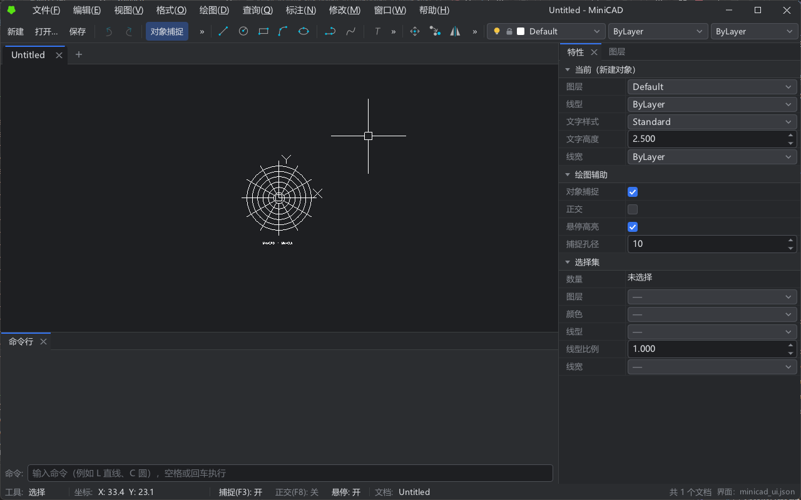

# MiniCAD

轻量级跨平台二维 CAD 编辑器（C++20）。Windows 桌面版（D3D11）和网页版（WebAssembly + WebGL2）共用同一套界面代码，外观与操作完全相同。



## 功能

- **绘图**：直线、点、矩形、圆、圆弧、椭圆、多段线、样条曲线、多线、构造线、射线、二维填充、区域覆盖、面域与布尔运算、表格、光栅图像、图案填充
- **修改**：移动、复制、镜像、偏移、旋转、缩放、圆角、倒角、拉伸、修剪、延伸、打断、阵列、分解；夹点编辑；撤销 / 重做
- **标注与文字**：线性、角度、半径、直径、折弯、弧长、坐标标注，引线与多重引线，关联标注；单行 / 多行文字原位编辑，SHX 与 TrueType 字体，文字样式
- **图层与块**：图层开关、锁定、颜色、线型、线宽；创建块、插入块
- **绘图辅助**：对象捕捉、正交、极轴、动态输入、AutoCAD 式命令行
- **文件**：MiniCAD 文档（`.mcad` 二进制 / `.json`）；打开 DWG（R13～2018）与 DXF（R12～2018）；保存为 AutoCAD 2018 或 2013/2014 格式的 DWG / DXF
- **界面**：多文档标签，可停靠面板，菜单与工具栏由 `assets/ui/minicad_ui.json` 描述（修改后自动重新加载），深色 / 浅色主题

## 下载

在 [Releases](https://github.com/CHMOSE023/MiniCAD/releases) 页面下载：

- `MiniCAD-<版本>-windows-x64.zip`：桌面版，解压后运行 `MiniCADWin.exe`
- `MiniCAD-<版本>-web.zip`：网页版，把其中的 `index.*` 放到任意静态网站，用支持 WebGL2 的浏览器打开（必须经 HTTP 访问，不能直接双击本地文件）

## 构建

### 桌面版

需要 CMake 3.20+、Ninja、Visual Studio（MSVC，C++20）。在普通命令行里需要先调用 `vcvars64.bat`，或者在"Developer Command Prompt for VS"中执行：

```bat
cmake --preset debug
cmake --build --preset debug
out\debug\MiniCADWin\MiniCADWin.exe
```

Release 版用 `release` 预设（窗口程序，不带控制台）。

### 网页版

需要 [Emscripten SDK](https://emscripten.org)（脚本默认路径 `D:\dev\emsdk`，在 `build_wasm.bat` 顶部修改）：

```bat
build_wasm.bat serve
```

构建 Release 版并在 http://localhost:8080/MiniCADWeb/ 启动本地服务器。输出在 `out/build/wasm/MiniCADWeb/`。

### 测试

```bat
run_tests.bat
```

编译并运行核心库、MiniGUI、MiniDWG 的单元测试和 MiniGUI 截图对比测试。桌面版另有端到端自测：`MiniCADWin.exe --selftest`。

## 目录结构

```
MiniCAD
├── src/                    # MiniCADLib 核心库：实体、场景、文档、编辑器、视口、文字（命名空间 MiniCAD）
│   ├── UI/                 # MiniGUI 保留模式界面库（命名空间 MiniGUI）
│   └── Serialization/      # 原生格式（JSON / 二进制）+ MiniDWG DWG/DXF 读写库（Codec/ Database/ Dwg/ Dxf/）
├── apps/
│   ├── Common/             # 主窗口界面与逻辑（桌面版、网页版共用），平台服务经 AppPlatform 接口提供
│   ├── Win32/              # 桌面版 MiniCADWin：窗口、D3D11、消息循环
│   └── Web/                # 网页版 MiniCADWeb：画布、WebGL2、浏览器文件选择与下载
├── wasm/                   # 旧版 C 接口 WASM（默认不编译，-DMINICAD_BUILD_LEGACY_WASM=ON）
├── tests/                  # Core/ UI/ Serialization/ 单元测试，Data/ 测试数据
├── assets/                 # 字体、图标、填充图案、界面描述文件
├── cmake/                  # MiniGUI、MiniDWG 的目标定义
├── tools/                  # make_web_font.py：生成网页版界面字体
├── 3rd/                    # stb_image、stb_truetype
└── docs/                   # 教程、各库的开发计划、发布说明
```

## 版本发布

推送 `v*` 标签（例如 `v0.1.0`）后，GitHub Actions 自动编译桌面版和网页版、运行测试，并创建 Release 上传两个 zip 包。发布说明取自 `docs/release-notes/<标签>.md`。

## 第三方组件

- MiniDWG 移植自 [ACadSharp](https://github.com/DomCR/ACadSharp)（MIT），`tests/Data/Dwg/` 下的样例图纸也来自该项目
- 网页版界面字体由 Noto Sans SC（SIL OFL 1.1）生成
- stb_image、stb_truetype（公有领域或 MIT，二选一）

详见 [THIRD_PARTY_NOTICES.md](THIRD_PARTY_NOTICES.md)。
