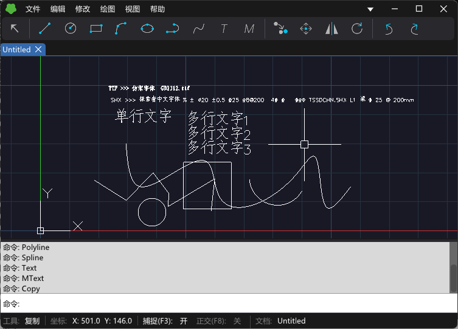

# MiniCAD

一个轻量级跨平台二维 CAD 编辑器（C++20），支持 Windows 桌面端（D3D11）和 WebAssembly。



## 目录结构

```
MiniCAD
├── src/                    # MiniCADLib 核心库（命名空间 MiniCAD）：实体、场景、文档、编辑器、视口、文字
│   ├── UI/                 # MiniGUI 保留模式界面库（命名空间 MiniGUI）
│   └── Serialization/      # 原生格式（JSON / 二进制）+ MiniDWG DWG/DXF 读写库（Codec/ Database/ Dwg/ Dxf/，命名空间 MiniDWG）
├── apps/Win32/             # Windows 桌面程序 MiniCADWin（含 D3D11 / Software 渲染后端）
├── wasm/                   # WebAssembly 构建目标
├── tests/                  # Core/ UI/ Serialization/ 测试与 Data/ 测试数据
├── assets/                 # 字体、图标、填充图案、界面描述文件
├── cmake/                  # MiniGUI、MiniDWG 的目标定义
├── 3rd/                    # stb_image、stb_truetype
└── docs/                   # 教程与各库的开发计划
```

## 构建

需要 CMake 3.20+、Ninja、MSVC（C++20）。在普通命令行中需先调用 `vcvars64.bat`。

```bat
cmake --preset debug
cmake --build --preset debug
out\debug\MiniCADWin\MiniCADWin.exe
```

运行全部测试：

```bat
run_tests.bat
```

WebAssembly：`build_wasm.bat`（脚本顶部配置 emsdk 与 Ninja 路径），输出在 `out/build/wasm/`。

## 许可

MiniDWG 部分移植自 [ACadSharp](https://github.com/DomCR/ACadSharp)（MIT），`tests/Data/Dwg/` 下的样例图纸也来自该项目，详见 [THIRD_PARTY_NOTICES.md](THIRD_PARTY_NOTICES.md)。
